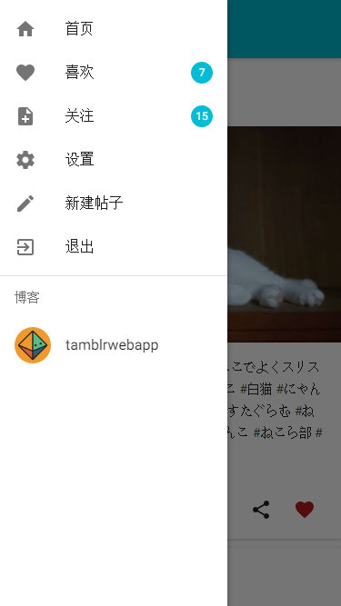

# React Demo with tumblr api
这个[demo](https://tumblrwebapp.herokuapp.com)使用了react + react-router + redux + webpack + material-ui + express, 通过tumblr api获取数据,服务器端渲染页面。
## Requirements
-   NodeJS>=6.x
-   tumblr账号
-   tumblr的Consumer Key和Secret Key

tumblr api的文档和key的申请方法在[此处](https://www.tumblr.com/docs/en/api/v2)。
## Install
```sh
git clone git@github.com:blinkcat/tumblr-webApp.git
npm install
```
**NOTE:** 需要在项目根目录下建立.env文件
```sh
cp .env.example .env
```
然后将你申请到的Consumer Key和Secret Key填入其中。在`production`环境中，为了安全起见，需要通过命令行设置环境变量来保存key和secret。如果你使用heroku，可以通过[这种方式](https://devcenter.heroku.com/articles/config-vars)来设置环境变量。   
然后
```sh
npm start
```
接着访问[http://localhost:8080](http://localhost:8080)
## screenshot
  
## Tests
暂无
